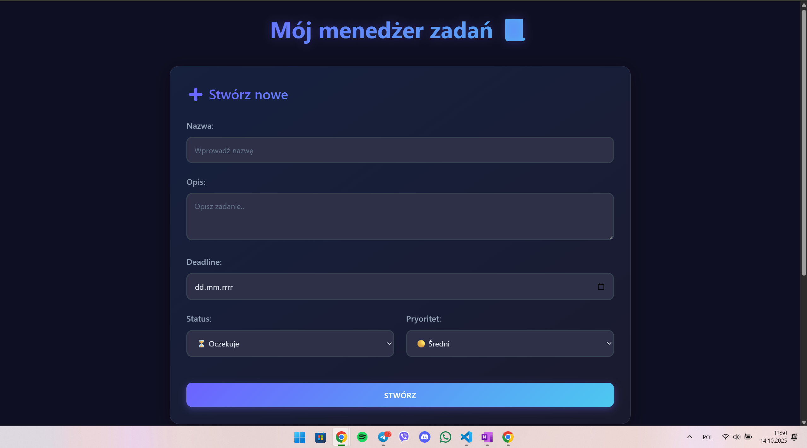
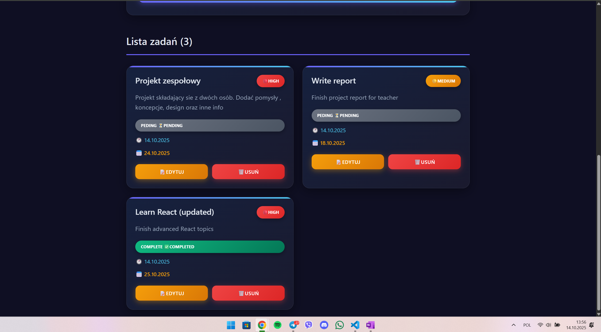

# CRUD Project - Task Manager



## Description:
Prosty menedżer zadań TO-DO list (pełny CRUD funkcjonał)
- Wyświetlanie zadań
- Dodawanie nowych zadań
- Edytowanie
- Usuwanie

## Technologies:
- Frontend: React + Vite
- Backend: Node.js + Express
- Database: PostgreSQL

## How to start app local?

### Versions:
- Node.js 16+
- PostgreSQL

### Step 1: PostgreSQL DataBase
```bash
cd database

# Migration
psql -U postgres -f migration.sql
```

### Step 2: Backend configuration

```bash
cd backend

# Install requirements
npm install

# Create .env file (fill your own values) 
cp .env.example .env
```
(You must chnage _User_password_ into your own)

### Step 3: Start Backend server

```bash
# Dev mode
npm run dev

# OR production mode
npm start
```

### Step 3: Start Frontend

```bash
# Install requirements
npm install

# Dev mode
npm run dev
```

## API Endpoints
(Każdy endpoint zwraca błędy 400,404,500 + validacja + success 200,201,204)

- GET /tasks - otrzymanie wszystkish zadań
- GET /tasks/:id - otrzymanie zadania po ID
- DELETE /tasks/:id - usuń zadanie
  
- POST /task - dodawanie nowego zadania
```
{
  "title_name": "New Task",
  "description": "Description",
  "deadline_date": "2025-00-00",
  "priority": "medium",
  "status": "pending"
}
```
- PUT /tasks/:id - aktualizacja zadania
```
{
  "title_name": "Update name",
  "status": "completed"
}
```

## Access in browser:
- Frontend: http://localhost:5173
- Backend API: http://localhost:3001

---------------------------------------------------------------
_**Creator: Anastasiia Bzova 2025**_
